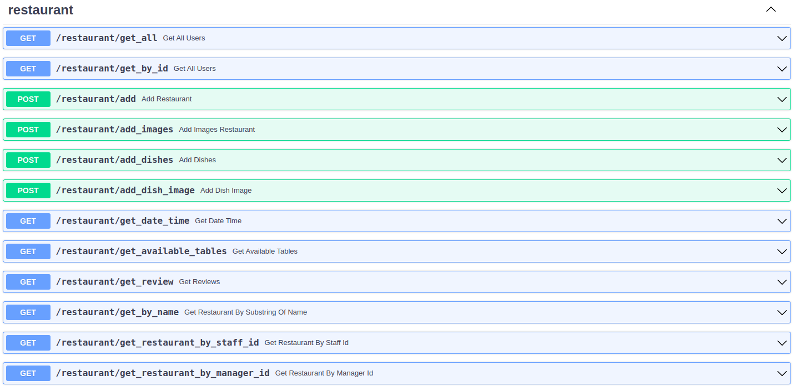
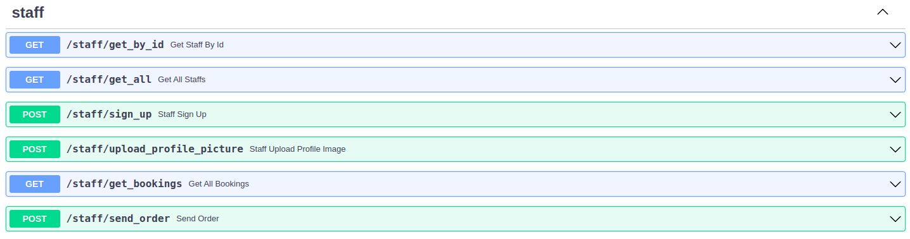
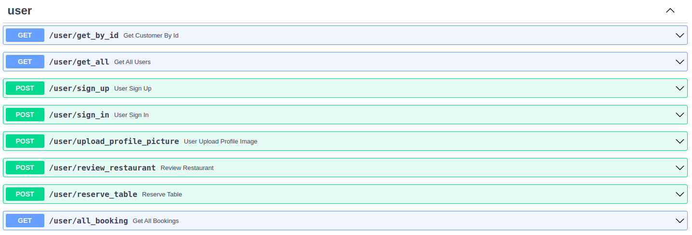
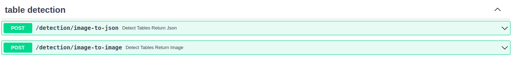
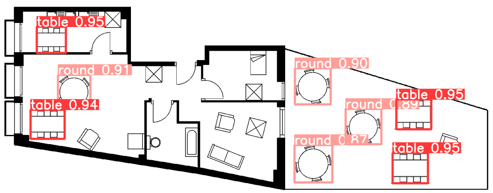

# Restaurant-Management

This repository serve as the backend for the restaurant management application for the Software Engineering Course:
Sping 2023. It provides multiple endpoints to be called from the frontend, as well as hosts a Yolov5 obejct detection
model.

## Technologies used

- MySQLite
- FastAPI (API framework)
- GPT
- YoloV5

## Installation

Clone the repo and install all the requirements to get the dependencies needed.
We advise to create a virtual environment with python 3.8 as interpreter.

```bash
pip install -r requirements.txt
```

## Project Structure

```bash
.
├── api
│   └── controllers
├── application
│   ├── manager management
│   ├── restaurant management
│   ├── staff management
│   ├── user management
│   └── table detection
├── data
│   ├── images
│   ├── credentials.py
│   └── data.db  
├── model
│   └── best.pt 
├── domain
│   ├── contracts
│   ├── exceptions
│   └── models
├── persistence
│   ├── repositories
│   ├── services
│   └── sql_app
├── shared
│   └── helper
├── containers.py
├── main.py
└── README.md
```

## Dataset Folder Structure

The following is an example of how the

**data** folder will be structured as follows:

```sh
├──data/
    ├──images/
        ├──dishes
        ├── restaurants
        ├── staffs
        └── users
    ├── credentials.py
    ├── data.db
    └── data.json              
```

## Usage

As the application calls GPT api, you will need to generate your own api keys. go to

```
.
└── core
    └── nlp
        └── nlp.py
```

and replace the gpt-api-key by your own generated one.

In the root directory of the project, type the following command in the terminal

```bash
python3 main.py
```

this will start the API at port 2000. For easier visualization, surf to http://localhost:2000/docs
This will give a simple representation of the available endpoints.

Endpoint services can be divided into 4 categories:

1. Restaurant-related services
2. Staff-related services
3. User-related services
4. Table-detection-related services

### Restaurant Services

These endpoints provide different functionalities related to restaurant management. A detailed documentation has been
provided under each endpoint using Swagger.


### Staff Services



### User Services



### Table Detection Services



/detection/image-to-json

#### Request Parameters

| Name    | Type | Description                        |
|---------|------|------------------------------------|
| `image` | byte | The image to be used for inference |

#### Response

The input image with bounding boxes around both round and rectangle tables, along with their respective confidence
scores

#### Example Response



If you would like to check the dataset used to train the object detection model, contact the developers

## Acknowledgments

- [Anthony Semaan](https://github.com/anthonySemaan01), Lebanese American University, Byblos, Lebanon
- [Antonio Chedid](https://github.com/t0t0-01), Lebanese American University, Byblos, Lebanon


